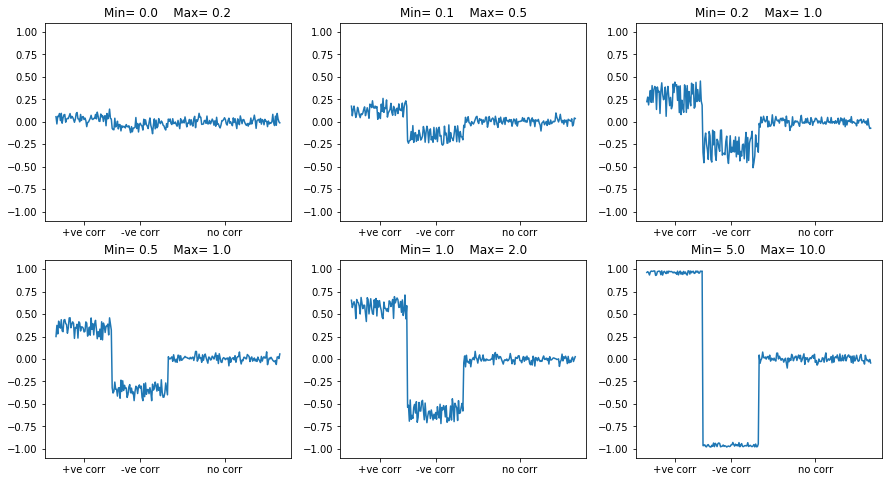

# Simulated Data Generator
This creates a generator that generates simulation data for testing machine learning algorithms.
It creates a labels vector (currently only for classification use so 0 and 1) and creates associated input data that
has variables that are positively correlated with it and other variables that are negatively correlated with it as well
as uncorrelated variables. Currently it only supports 1D data that can be used in the simplest ML algorithms like
fully connected neural networks. 

## Usage
You can find usage in the unit test and the associated python notebook.
Below are the correlation results of creating 1024 samples of 256 variables of which first 64 are positively correlated, second 64 are negatively correlated and the remaining 128 are uncorrelated.

## Imputation
TBD
